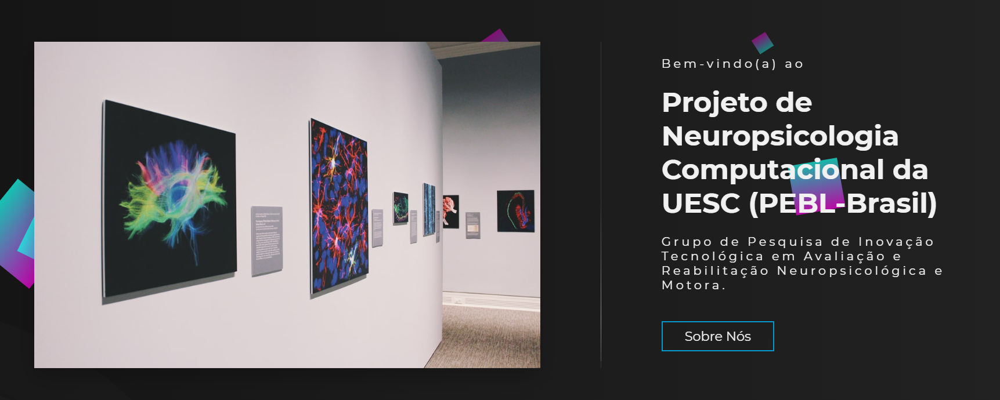

<div align="center" id="top"> 
  

&#xa0;

  <h1 align="center"><a href="https://igorroc.github.io/pebl-web" target="_blank">PEBL-Web</a></h1>

<a href="https://igorroc.github.io/pebl-web" target="_blank">Site</a>

</div>

<p align="center">
  

  

  

  

  

  

  
</p>

## Status

<h4 align="center"> 
	🚧  PEBL-Web 🚀 Em desenvolvimento...  🚧
</h4>

<hr>

<p align="center">
  <a href="#dart-sobre">Sobre</a> &#xa0; | &#xa0; 
  <a href="#sparkles-testes">Testes</a> &#xa0; | &#xa0;
  <a href="#rocket-tecnologias">Tecnologias</a> &#xa0; | &#xa0;
  <a href="#white_check_mark-requerimentos">Requerimentos</a> &#xa0; | &#xa0;
  <a href="#checkered_flag-começando">Começando</a> &#xa0; | &#xa0;
  <a href="#memo-Licença">Licença</a>
</p>

<br>

## :dart: Sobre

Desenvolvimento de testes neuropsicológicos computadorizados online para o contexto brasileiro

## :sparkles: Testes

🚧 [Stroop](https://igorroc.github.io/pebl-web/testes/stroop.html);\
🚧 [BST](https://igorroc.github.io/pebl-web/testes/bst.html);\
🚧 [Sternberg](https://igorroc.github.io/pebl-web/testes/sternberg.html);\
🚧 [Torre de Londres](https://igorroc.github.io/pebl-web/testes/torre.html);

## :rocket: Tecnologias

As seguintes ferramentas serão utilizadas no projeto:

- [Node.js](https://nodejs.org/en/)
- [PostgreSQL](https://www.postgresql.org)
- [TypeORM](https://typeorm.io/#/)
- [Python 3.8](https://www.python.org)
- [Anaconda](https://www.anaconda.com/open-source)
- [Scikit Learn](https://scikit-learn.org/stable/)
- [Keras](https://keras.io)


## :white_check_mark: Requerimentos

Antes de começar, você precisa ter o [Git](https://git-scm.com) e [Node](https://nodejs.org/en/) instalados.

## :checkered_flag: Começando

```bash
# Clone este projeto
$ git clone https://github.com/IgorRoc/pebl-web.git

# Acesse
$ cd pebl-web

# Instale as depencencias
$ yarn

# Rode o projeto
$ yarn start
```

## :memo: Licença

Esse projeto está sob licença MIT. Para mais detalhes, veja o arquivo de [LICENÇA](LICENSE.md).

Feito com :heart: por <a href="https://github.com/IgorRoc" target="_blank">Igor Rocha</a>, <a href="https://github.com/inlima" target="_blank">Isaac Lima</a>, <a href="https://github.com/jvrupp" target="_blank">João Rupp</a>

&#xa0;

<a href="#top">Back to top</a>
